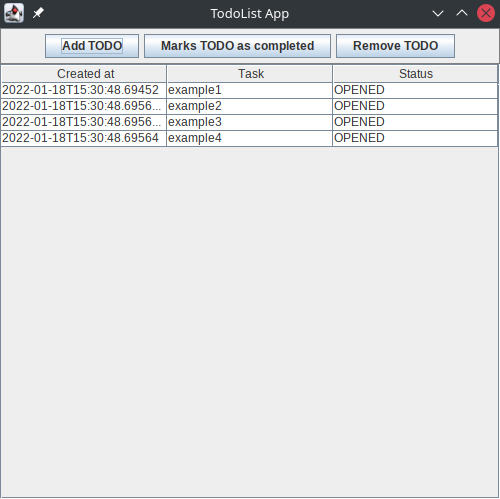

## Overview

This project contains a technical exercise for Java programmers.

## Building

The build requires to use Maven. The configuration file is provided. Please feel free to add any dependencies that you
may need.

## Description of the exercise

The project contains a very simple Swing application.

The application is simple. It handles a list of Task objects. Each task object represents something to be realized, it
contains a creation date and a status.

We have three buttons that enables the user to add a task, remove a task and mark a task as finished.

The implementation is not finished, and the goal of this exercise is to implement the missing features.

### Missing features to be implemented

#### Implement the function to add a new task

The button to add a task is not implemented. We created the _AddTaskClickListener_ listener that is invoked when we click on the button, but it does nothing.

*Implement the listener* that the user can input the required information to add a new task to the task list. Once the task is added, the model should be updated and the UI refreshed accordingly.

#### Implement the function to remove a task

The button to remove a task is not implemented. We created the _RemoveTaskClickListener_ that is invoked when we click on the button, but it does nothing.

To remove a task, the _Task_ object must be removed from the model, the model refreshed, and the UI refreshed accordingly.

#### Implement the function to mark the task as completed

The button to marks the task as completed is not implemented. We created the _markTaskCompletedClickListener_ listener that is invoked when we click on the button, but it does nothing.

To mark a task, the status of the _Task_ object must be updated, the model refreshed, and the UI refreshed accordingly.

#### Complementary question

We would like to render differently tasks that are completed from opened tasks ( for example a different background color).

We provided the _TaskStatusCellRenderer_ to implement such behavior. So be creative and differentiate the task status graphically.

## Quality standards

You can use any software methodologies that you feel appropriate for your task as TDD, unit testing, DDD etc. 

## Authors

* Sylvain Leroy - [sleroy](https://github.com/sleroy)
* Roman Beskrovnyi - [romankh3](https://github.com/romankh3)

## License

This project is Apache License 2.0 - see the [LICENSE](LICENSE) file for details
